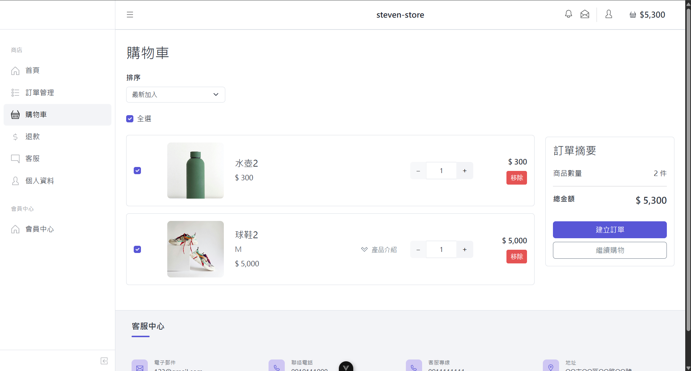
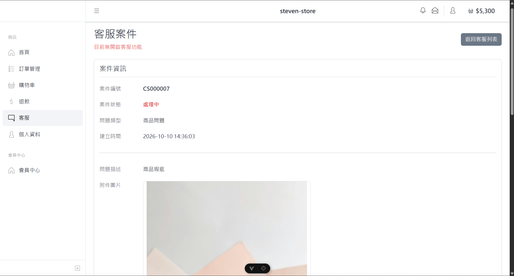
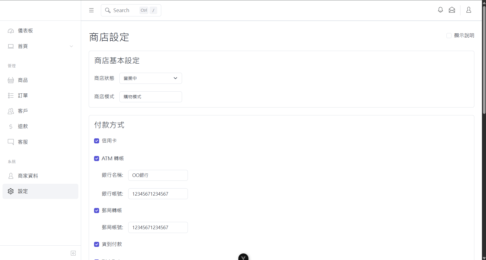
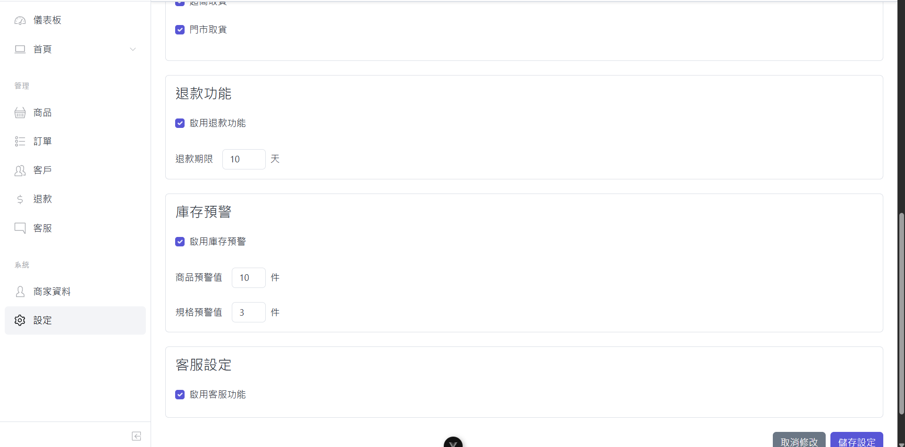
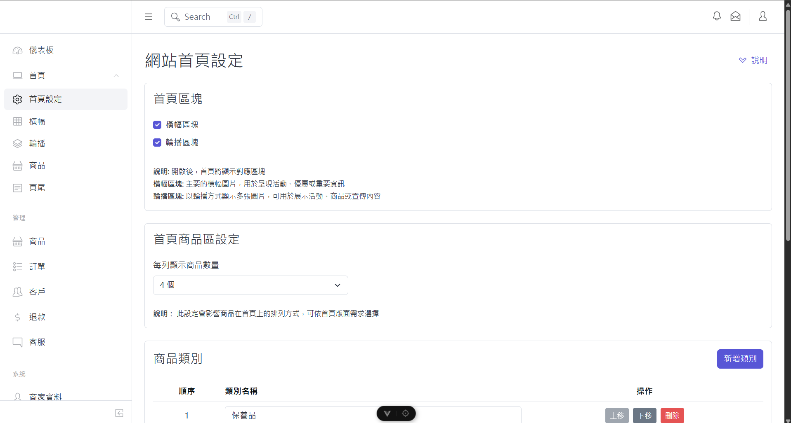
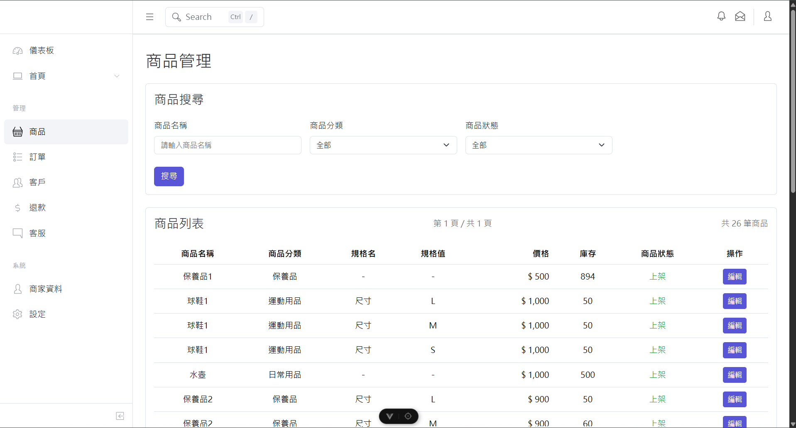
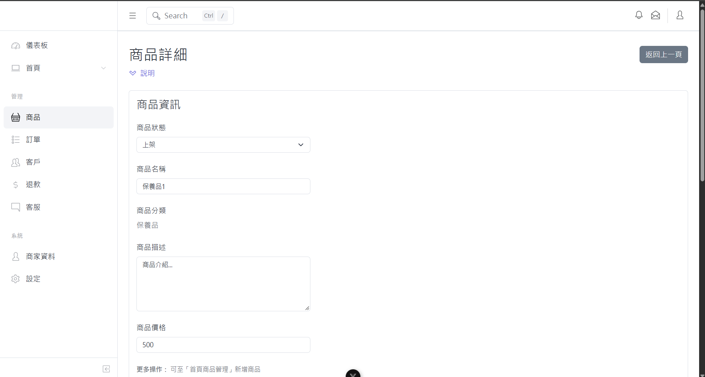
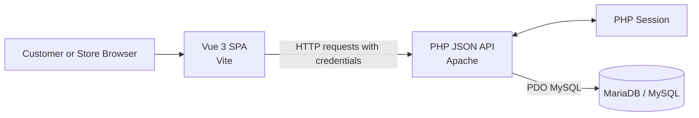
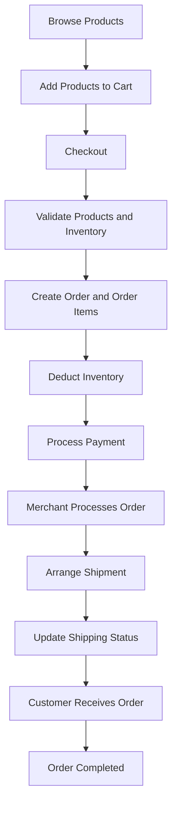
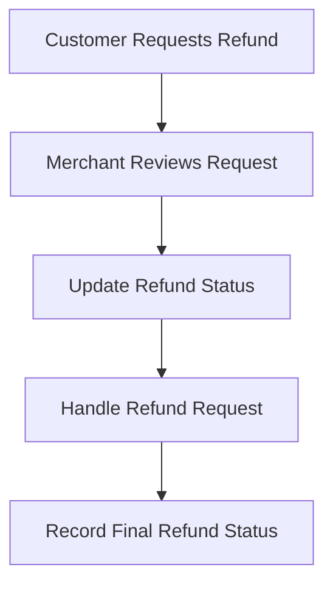

# Customizable E-commerce Platform

A customizable multi-store e-commerce platform designed for small and medium-sized businesses. Merchants can manage their own products, storefront content, orders, inventory, and settings, with support for both Shopping Mode and Showcase Mode.

> **Project Status:** This project is under active development and is not yet production-ready.
>
> Credit card payment is currently simulated. No external payment gateway is integrated.

## Project Motivation

Small and medium-sized businesses may want to establish their own online stores but lack the technical resources or budget to develop and maintain an e-commerce website independently.

This project aims to lower the barrier to building and managing online stores by providing a customizable multi-store platform. Merchants can manage their products, orders, inventory, and storefront content through a centralized management interface without having to develop an entire e-commerce system from scratch.

The platform supports both Shopping Mode and Showcase Mode, allowing merchants to choose between selling products online and displaying products without enabling the ordering process.

## Demo

[Watch the Project Demo on YouTube](https://youtu.be/5akC-Kb6JoM)

## Screenshots

### Customer Features

#### Shopping Cart

Displays selected products, quantities, prices, and subtotal before checkout.



#### Customer Service

Allows customers to communicate with stores through the customer service interface.



### Store Management

#### Store Settings

Enables merchants to configure store information and operating preferences.





#### Homepage Customization

Allows merchants to customize their storefront homepage content and visual sections.



#### Product List Management

Enables merchants to manage products, prices, specifications, status, and inventory.



#### Product Details Management

Supports product detail configuration, including product specifications and related inventory settings.



## Features

### Customer Storefront

- Browse store homepages, product categories, and product details.
- Search for products.
- Select product specifications and manage shopping cart quantities.
- Place orders and view order history and order details.
- Manage customer profile information.
- Submit refund requests.
- Contact customer service.
- Manage orders, refunds, and customer service across multiple stores through a centralized customer center.

### Store Management

- Register and manage a store account.
- Create and manage products, categories, product specifications, images, and inventory.
- Manage orders and delivery status.
- Customize storefront content, including homepage sections, banners, sliders, and footer details.
- Configure store payment and delivery methods.
- Manage customer information, refund requests, and customer service requests.

### Store Modes

- **Shopping Mode:** Enables product browsing, shopping cart, checkout, and order processing.
- **Showcase Mode:** Displays products without enabling the shopping and ordering workflow.

## Technical Highlights

- **Multi-Store Data Model:** Uses store-related database records and relationships to support multiple merchants.
- **Session-Based Authentication:** Uses PHP sessions for customer and store authentication.
- **Product Specifications and Inventory:** Supports products with and without specifications, with prices and stock managed according to product type.
- **Transactional Order Creation:** Uses database transactions to coordinate order creation, order item records, and inventory updates.
- **Relational Database Design:** Connects stores, products, specifications, carts, orders, payments, refunds, storefront settings, and customer service records.
- **Password Security:** Uses PHP `password_hash()` and `password_verify()` for password handling.

## Technical Challenges and Solutions

### 1. Multi-Store Data Isolation

**Challenge:** Products, categories, orders, and store settings belong to different stores. Incorrect store identification or database queries could expose or modify data belonging to another store.

**Solution:** Used `store_id` to associate records with their respective stores and applied store-related conditions in database queries. Composite foreign keys were also used in selected relationships to help maintain consistency between stores and their related records.

### 2. Session-Based Authentication

**Challenge:** The frontend and backend need to maintain login state across API requests while protecting customer and store management operations.

**Solution:** Used PHP sessions to maintain authentication state and included credentials in frontend API requests. Backend authentication middleware checks the session before allowing access to protected operations.

### 3. Transactional Order Creation and Inventory Management

**Challenge:** Creating an order involves multiple database operations, including inserting the order, recording order items, and deducting inventory. Partial execution could leave order records and stock quantities inconsistent.

**Solution:** Used database transactions to coordinate related order creation and inventory operations. Product availability and stock are validated before order processing, and transaction rollback can prevent partial database updates when an operation fails.

### 4. Product Specifications and Stock Validation

**Challenge:** Products may have specifications, such as size or color, or may be sold without specifications. Each type requires different inventory and pricing logic.

**Solution:** Used the product's `has_spec` field to distinguish between the two cases. Products with specifications use the corresponding `PRODUCT_SPEC` price and stock, while products without specifications use the values stored in `PRODUCT`. Stock validation is required when adding items to the cart and creating orders.

## Technology Stack

### Frontend

- Vue 3
- JavaScript
- Vite
- Vue Router
- Pinia
- CoreUI
- Bootstrap
- Swiper

### Backend

- PHP
- PDO with the MySQL driver
- JSON APIs
- PHP sessions

### Database

- MariaDB / MySQL
- Relational database schema

### Development Tools

- XAMPP
- Node.js
- npm
- Git and GitHub

> **Version Note:** The current frontend dependency configuration resolves Vue to a release-candidate (`rc`) version. Refer to `frontend/package.json` for the exact dependency configuration.

## Architecture

The platform uses a Vue single-page application for the user interface, PHP JSON APIs for backend operations, PHP sessions for authentication, and MariaDB/MySQL for persistent data storage.



## Order Processing Workflow

The following diagrams illustrate the order processing workflow, including checkout, inventory management, payment, shipping, and refunds. These diagrams provide a high-level overview of the intended workflows.

### Order and Shipping Workflow



### Refund Workflow



### Key Processing Steps

1. **Product Browsing and Checkout:** Customers browse products, select product specifications when applicable, and proceed to checkout.
2. **Inventory Validation:** The backend validates product availability and stock before creating the order.
3. **Order Creation:** The system creates the order and its associated order items.
4. **Inventory Update:** The corresponding product or product specification stock is deducted.
5. **Payment Processing:** Customers select an available payment method and complete the required payment steps.
6. **Order Fulfillment and Shipping:** Merchants process orders, arrange shipment, and update shipping status.
7. **Order Completion:** Customers receive their orders and the order proceeds to completion.
8. **Refund Management:** Customers can submit refund requests, and merchants can review requests and manage refund statuses according to the store's refund settings.

## Database Design

The database uses a relational data model to organize customers, stores, products, orders, payments, refunds, and storefront settings. Foreign keys maintain relationships between related records and help ensure data consistency.

The database schema contains 24 tables covering customer accounts, store management, product catalogs, shopping carts, order processing, payments, refunds, storefront customization, and customer service.

### Core Table Relationships

The following tables form the core of the e-commerce platform.

| Table | Relationship | Description |
|---|---|---|
| `STORE` | One-to-Many with `PRODUCT` | Each store can manage multiple products. |
| `STORE` | One-to-Many with `CATEGORY` | Each store can define its own product categories. |
| `CATEGORY` | One-to-Many with `PRODUCT` | Each category can contain multiple products within the same store. |
| `PRODUCT` | One-to-Many with `PRODUCT_SPEC` | A product can have multiple specifications, such as sizes or colors. |
| `PRODUCT` | One-to-Many with `PRODUCT_IMAGE` | Each product can have multiple images. |
| `CUSTOMER` | One-to-Many with `ORDERS` | A customer can place multiple orders. |
| `STORE` | One-to-Many with `ORDERS` | Each store can receive multiple orders from customers. |
| `ORDERS` | One-to-Many with `ORDER_ITEM` | Each order can contain multiple order items. |
| `ORDERS` | One-to-One with `PAYMENT` | Each order can have at most one payment record. |
| `ORDERS` | One-to-One with `REFUND` | Each order can have at most one refund record. |

### How the Data Is Organized

**Store and Product Management**

The `STORE` table represents individual merchants on the platform. Each store can manage its own `CATEGORY` and `PRODUCT` records. Products can have multiple `PRODUCT_SPEC` records when specifications such as size or color are required. Product images are stored separately in `PRODUCT_IMAGE`.

**Order Processing**

The `ORDERS` table records the customer, store, recipient information, order amounts, and order and delivery statuses. The `ORDER_ITEM` table stores the individual products included in each order, including product names, specification names, quantities, and prices at the time of ordering.

This separation allows one order to contain multiple items while preserving the item details and prices recorded when the order was placed.

**Payments and Refunds**

The `PAYMENT` table stores payment methods, amounts, and payment statuses. The `REFUND` table records refund requests, reasons, review statuses, and merchant responses. Both tables reference the corresponding order and store.

**Store Configuration**

Tables such as `STORE_SETTING`, `STORE_PAYMENT_METHOD`, `STORE_DELIVERY_METHOD`, and `WEBSITE_SETTING` store configuration separately from the main store record. This allows each merchant to customize store operation, payment methods, delivery methods, and storefront presentation.

### Database Resources

- [Database Schema](database/schema.sql)
- [Simplified ER Diagram](docs/design/ER_Diagram_Simplified_v1.png)
- [Relational Schema (PDF)](docs/design/Relational_Schema_v1.pdf)

## Getting Started

The project is configured for local development using XAMPP for the PHP backend and database, with Vite serving the frontend.

### Prerequisites

- XAMPP with Apache, PHP, and MySQL/MariaDB
- PHP PDO MySQL extension enabled
- Node.js `^22.18.0` or `>=24.12.0`
- npm

### 1. Set Up the Project

Clone the repository or place the project under the XAMPP web root:

```text
C:\xampp\htdocs\ecommerce-platform
```

The frontend API modules currently use URLs beginning with:

```text
http://localhost/ecommerce-platform/backend/api/
```

If you use a different project directory or port, update the relevant API URLs and CORS configuration.

### 2. Configure the Database

1. Start Apache and MySQL/MariaDB from the XAMPP Control Panel.
2. Import `database/schema.sql` through phpMyAdmin or the MySQL command-line client.
3. Check `backend/config/database.php` and update the database connection settings if necessary.

The current local development configuration uses:

| Setting | Value |
|---|---|
| Database | `ecommerce_platform` |
| Host | `localhost` |
| Port | `3306` |
| Username | `root` |
| Password | Empty by default |

> **Security Note:** These are local development settings. Configure secure credentials before deploying the application to a public server.

### 3. Load Sample Data (Optional)

If `database/insert_test_data.sql` is included in the repository, import it after creating the database schema to load sample records.

Check the sample data's image URLs and make sure the referenced image files are available. Update the URLs if necessary.

### 4. Install and Run the Frontend

Open a terminal and run:

```powershell
cd frontend
npm install
npm run dev
```

Open the local URL displayed in the terminal. The current CORS configuration expects the frontend origin to be:

```text
http://localhost:5173
```

An example customer storefront route is:

```text
http://localhost:5173/store-1
```

## Project Documentation

The project documentation includes requirements, wireframes, and database design resources.

- [Product Feature Specification (English)](docs/requirements/Product_Feature_Specification_EN.md)
- [Product Feature Specification (Traditional Chinese)](docs/requirements/Product_Feature_Specification_ZH.md)
- [Wireframes (PDF)](docs/design/Wireframe_v1.pdf)
- [Relational Schema (PDF)](docs/design/Relational_Schema_v1.pdf)
- [Simplified ER Diagram (PNG)](docs/design/ER_Diagram_Simplified_v1.png)

## Project Status and Roadmap

This project is under active development. The following features are planned for future releases and should not be considered implemented features.

### Platform Administration

- Super Admin dashboard for platform-wide store and user management.

### Product and Customer Experience

- Additional product specification types.
- Product review and rating system.
- Customer tagging and high-value customer identification.

### Analytics and Business Intelligence

- Order data analytics and reporting for store administrators.
- Cost and profit analysis.
- Customer growth and purchasing trend analysis.

### Marketing and Promotions

- Membership points and loyalty programs.
- Coupon and discount management.

### Payment and Order Management

- Support for multiple item refunds within a single order.
- Currency conversion for different currencies.

### AI and Cloud Integration

- AI-powered customer service and product recommendations.
- AWS cloud deployment and integration.

## Notes

- Credit card payment is currently simulated and is not connected to a real payment provider.
- Frontend API URLs and CORS settings are configured for the current local XAMPP/Vite setup. Additional configuration is required for deployment to another environment.
- The project does not currently have a configured automated test script.